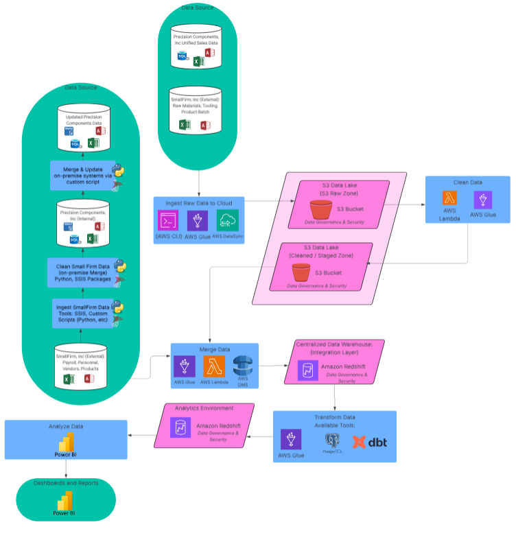
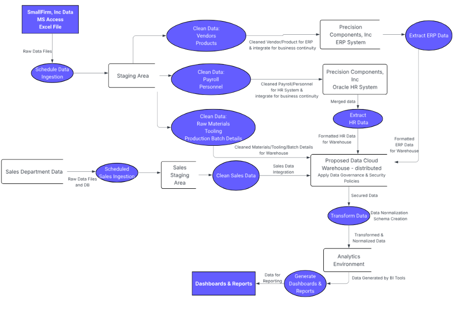
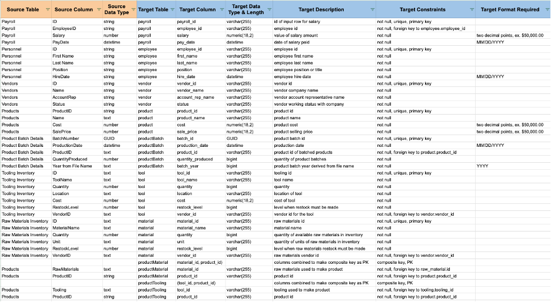
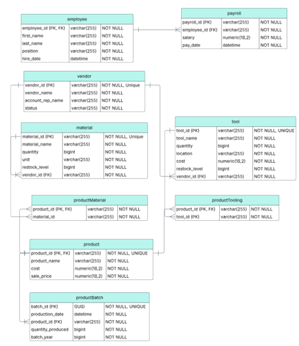

# README

## Project Overview

Developing and designing an AWS data processing architecture recommendation for an automotive company.

## Project Summary

This project recommends a comprehensive cloud-based data engineering recommendation for an automotive parts manufacturer. The primary objective was to facilitate the seamless acquisition of a smaller firm by integrating separate, legacy data systems into a centralized, scalable AWS-based architecture. The solution addresses data silos, automates daily ingestion, and provides a unified "single source of truth" for business intelligence.

## Business Problem Scenario

The automotive company is struggling with fragmented data management, highlighted by the acquisition of a smaller firm with their own data systems, which introduced incompatible legacy systems. These include MS Access and Excel that must be merged into the company's existing SQL Server and Oracle environments. The main issues are compounded by an isolated sales department that operate their own systems which prevent a unified view of overall sales performance. Futhermore, the company’s current on-premise infrastructure lacks the scalability required for a planned international expansion and is hindered by manual reporting across individual systems that fails to provide real-time, comprehensive insights.

The company's goals in pursuing a centralized data solution encompasses seamless data integration and automation, global scalability, customizable data governance and secuity, and unified and real-time data analytics.

## Proposed Architecture

The proposed solution utilizes a multi-layered AWS cloud architecture designed to handle both immediate operational merging and long-term analytical scaling. The design is visualized through two primary lenses: operational processing and logical data flow.

### Process Flow Architecture

The process flow illustrates the specific tools and software processes that power the data pipeline. It emphasizes the operational relationships between components, from raw ingestion to final visualization

- Ingestion Layer: Raw data from unified sales departments and SmallFirm, Inc. (MS Access/Excel) is ingested using AWS CLI, AWS Glue, and AWS DataSync.
- Staging & Storage: Data is initially housed in an Amazon S3 Data Lake (Raw Zone) before moving to a Cleaned/Staged Zone following automated processing.
- Integration Layer: All processed datasets are merged into a centralized Amazon Redshift data warehouse.
- Transformation Layer: Using dbt and SQL, data undergoes schema creation, normalization, and rigorous quality checks.
- Analytics Layer: Transformed data is served to Microsoft Power BI through native connectivity for real-time reporting.
  

### Data Flow (Level 1 DFD)

The Level 1 Data Flow Diagram (DFD) provides a logical view of how data moves through the business to meet specific organizational needs. It highlights the dual-track strategy of maintaining business continuity while building for the future.

- Operational Path: Shows the immediate cleansing and integration of vendor, product, and payroll data into the existing on-premise ERP and Oracle HR systems to ensure the company remains functional during the acquisition.
- Analytical Path: Depicts the flow of siloed sales and production data into a distributed cloud-based warehouse.
- Final Output: Illustrates how prepared, secured, and normalized data is landed in an analytics environment to support complex Online Analytical Processing (OLAP) and dashboard generation.

## Proposed Impact and Business Value

- **Operational Efficiency:** Automated ETL processes via AWS Glue and Lambda reduce manual script management and human error.
- **Strategic Growth:** The scalable cloud architecture allows the company to expand internationally without significant manual connectivity configuration.
- **Unified Insights:** Consolidating siloed sales and production data enables cross-departmental performance tracking and more informed decision-making.
- **Self-Service Business Intelligence:** Empowering non-technical users with Power BI focuses the data team on infrastructure rather than manual report generation.

## Solution Recommendation and Details

The recommendation started with an involved Source-to-Target mapping and normalization process along with tooling overviews and governance frameworks:

- Data Normalization: Transformed "Products.RawMaterials" and "Products.Tooling" from unstructured text into normalized link tables (productMaterial and productTooling) with composite primary keys to handle many-to-many relationships.
  - The entity relationship diagram depicts the recommended normalized tables derived from the data mapping table.
    

    

- Schema Standardization: Enforced consistent naming conventions (camelCase for tables, snake_case for attributes) and optimized data types (e.g., VARCHAR(255) for strings, NUMERIC(18,2) for currency) to ensure SQL Server compatibility.

- Governance & Compliance: Established data quality checks and version-controlled transformations via dbt to ensure compliance with privacy and regulatory standards.

## Tools Used

- Excel
- Lucidchart
