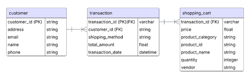
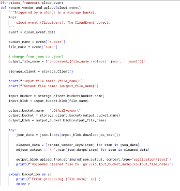
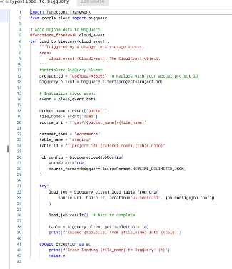
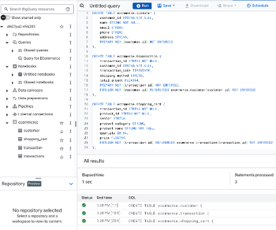
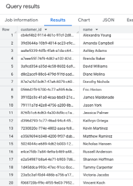
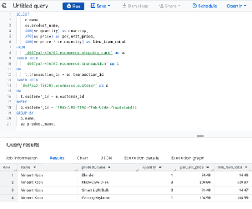

# README

## Executive Summary

This project proposes and executes a comprehensive migration to Google BigQuery, a serverless cloud data warehouse, to ensure scalability, reliability, and real-time analytical capabilities.The solution focuses on transitioning from encumbered, synchronous systems to a modular, asynchronous cloud environment that supports high-volume, high-variety data while maintaining a 99.99% availability SLA.

## Business Problem Scenario

The business problem for this project is to provide a cloud-based data solution for an e-commerce company that sells a variety of products clothes to homegoods to electronics to toiletries. The company is facing infrastructure strain while managing 10TB of daily transaction data on a traditional on-premises system. Data sources from the company include e-commerce data, customer service interactions, third-party vendors, and internal operations. At the time of the inquiry, the data from these sources are ingested by isolated on-premise platforms that don't talk to each other.

The company's goals in considering a cloud-based data solution includes the following:

1. Increase sales and direct marketing strategies
2. Establish a more robust and efficient inventory management system
3. Improve customer management and relationships

## Proposed Architecture

The solution leverages the Google Cloud Platform (GCP) ecosystem, centered on BigQuery's decoupled storage and compute architecture.

1. Data Storage & Management

- BigQuery Storage: Uses a columnar format to optimize query speed and efficiency for large-scale analytical work.
- Storage Classes: Implements a multi-tiered approach to optimize costs by enabling standard, nearline/coldline, and archive based on data category and need

2. Logical Data Model
   

- The data is structured using a Star Schema to minimize redundancy and improve query performance:
  - Transactions (Fact Table): Centralized records for revenue analysis.
  - Customers (Dimension Table): Secure storage of PII, enabling region-specific privacy controls.
  - Shopping Cart (Dimension Table): Detailed product information per transaction to minimize data bloat in the fact table.

## Proposed Impact and Business Value

1.  Cost-Efficiency: A "pay-as-you-go" model ensures the company only pays for the storage and query resources they consume.
2.  Real-Time Insights: Native support for streaming data and integration with tools like Looker Studio enables quick, data-driven decision-making.
3.  Scalability: The system automatically scales compute resources, removing the need for manual provisioning.

## Solution Implementation

### Iterative Development & Data Cleaning

- Process Evolution: I iteratively transformed the solution from a manual data cleaning process in a local Jupyter Notebook to a fully automated, cloud-native ETL (Extract, Transform, Load) solution.

- Data Scrubbing: I developed a Python-based helper function (rename_vendor_key) to clean the "vendor" field by removing trailing white spaces that previously caused upload errors.

  

### Serverless Pipeline Architecture

- Automated Triggers: I used Google Cloud Storage buckets to centralize data and used them as event triggers for ELT automation.

- Cloud Functions: I built two Cloud Functions to handle the pipeline:
- Function 1 (ETL): Automatically listens for raw JSON uploads, cleans the data, and exports a JSONL file to a processed storage bucket.

  

- Function 2 (Loading): Automatically detects the new JSONL file and loads its contents directly into a BigQuery staging table.

  

### Database Modeling & Population

- Staging & Normalization: I implemented a multi-stage loading process where data first landed in a staging table before being distributed into a normalized star schema model.

- Star Schema Implementation: I refactored the database code to create and populate three distinct tables: customer, transaction, and shopping_cart.

  

- Handling Complex Data: I used the UNNEST operator in SQL to unpack nested shopping cart arrays from the JSON records into individual rows for the dimension table.

  

- Deduplication Logic: I created recurring insert queries using NOT IN clauses to ensure that incremental data loads did not create duplicate records in the production tables.

  

### Validation & Business Intelligence

- Query Verification: I confirmed the integrity of the pipeline by executing complex SQL joins and aggregations to answer specific business questions:
  - Customer Analysis: Listing all unique customers and their IDs.

    
    

  - Transactional Detail: Retrieving line-item product details for specific customers by joining the three tables on their primary/foreign keys.

    

  - Performance Tracking: Calculating total purchase amounts per customer in descending order to identify high-value shoppers.

    
    

## Tools Used

- Python
- pandas
- NumPy
- matplotlib
- Jupyter Notebook
- Google Cloud Storage
- BigQuery
- Cloud Functions
