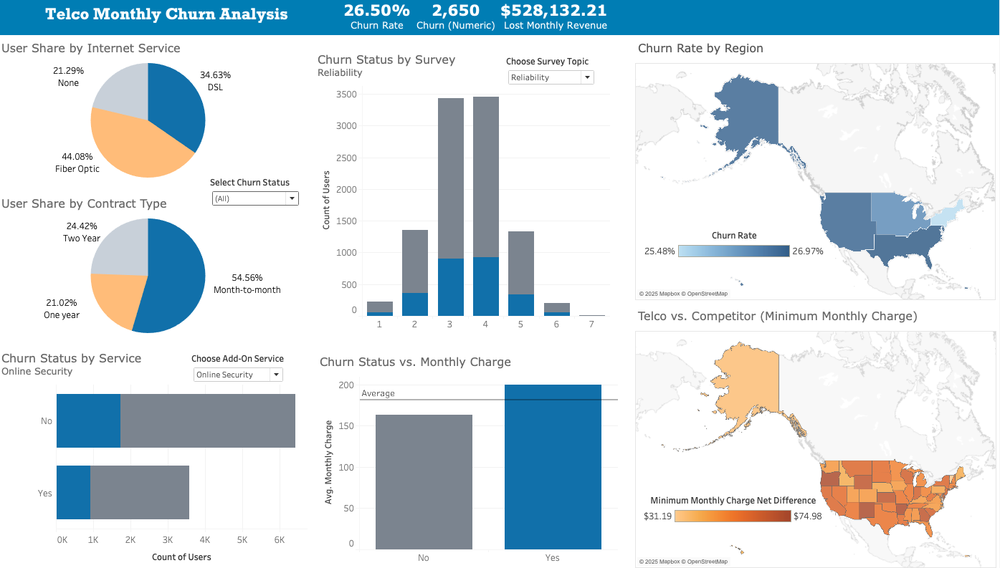
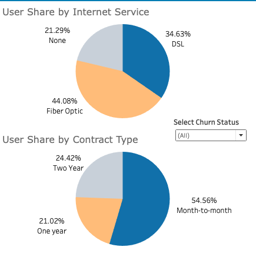
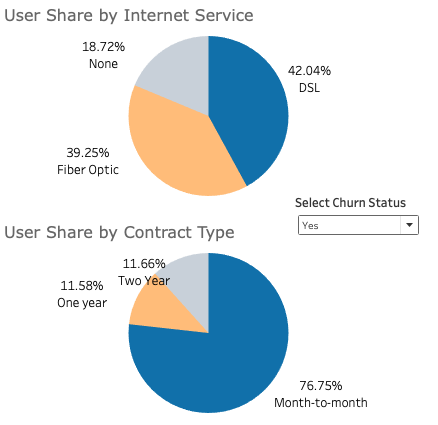
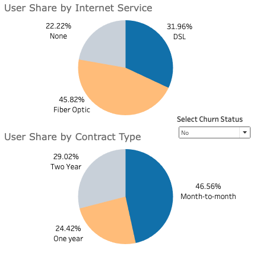
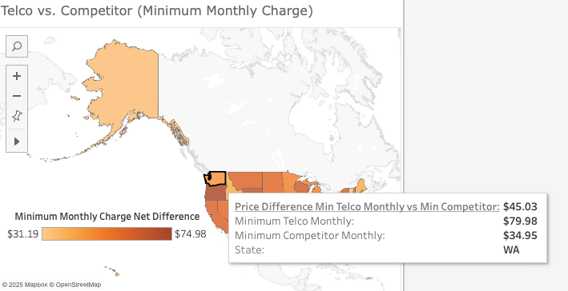
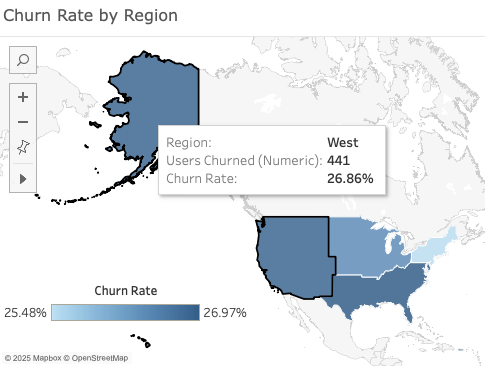
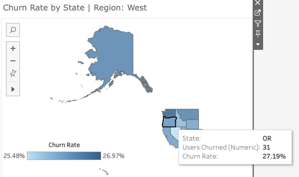

# README

## Project Summary

This project simulated a real-world business problem: an executive-level team, including a VP of Customer Experience, EVP of Sales, and Regional VPs, is asking for a monthly churn analysis dashboard. Leveraging Tableau, I created a colorblind-friendly, interactive dashboard. I used the provided dataset and augmented the data with an external dataset to derive additional metrics. The dashboard implements calculated fields, filtering, parameters, and Tableau's dynamic zone visibility.

This folder contains a concise single-slide executive summary that provides an overview of the dashboard insights and strategic recommendations.

## How to View the Project

### Options -

1.  Explore it [here on Tableau](https://public.tableau.com/app/profile/joanne.senoren/viz/Churn_Analysis_Dashboard_17379556602450/ChurnDashboard)
2.  Clone this Tableau file
3.  Review the screenshots [below](#dashboard-screenshots)

## Tools Used

- Tableau
- SQL
- PowerPoint

## Dashboard Screenshots

### Dashboard Overview

#### Filtered Data

#### Filtered - Churned Customers

#### Filtered - Non-Churned Customers

### Map Data

### Dynamic Zone Visibility

#### By Region

#### By State

