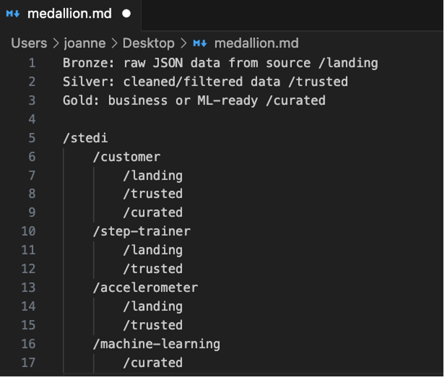
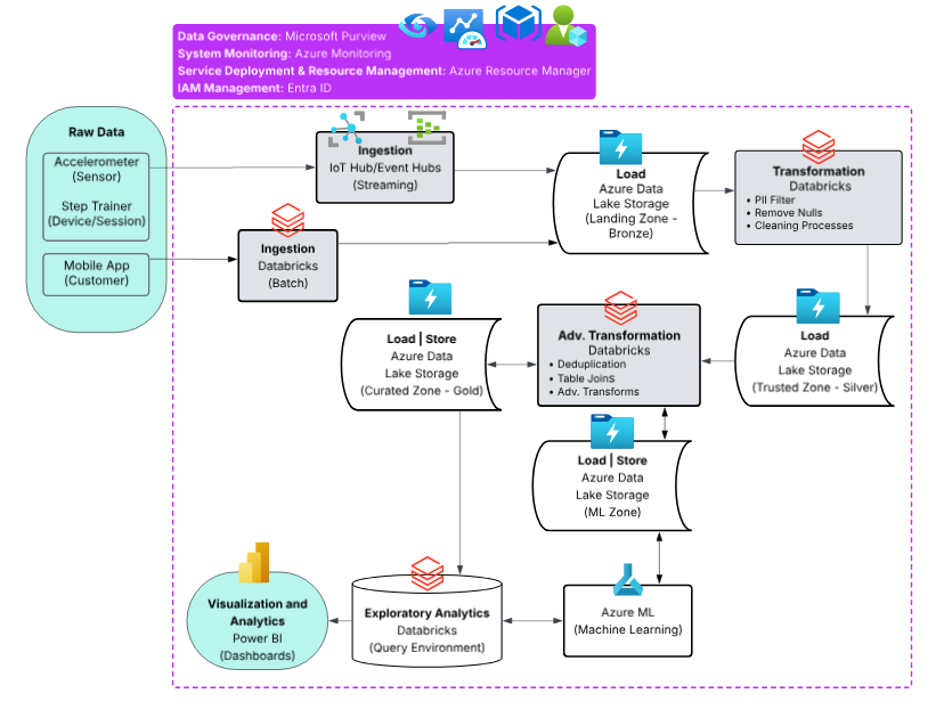
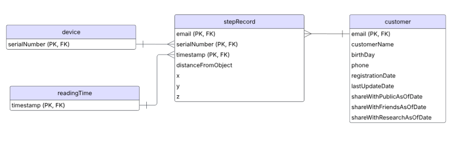

# README

## Executive Summary

This project actually represents two projects that provides two approaches to modern Big Data Engineering. The first part of this project began by learning and applying the fundamentals of data lakehouse architecture through a Udacity Nanodegree, where I initially built a solution using the AWS ecosystem for the STEDI team’s business scenario.

Building upon that foundation, the second phase of the project focuses on the strategic translation and implementation of that architecture within Microsoft Azure, if STEDI were to maintain a vendor relationship with Microsoft. The result is an Azure-based solution that is a robust, end-to-end ELT (Extract, Load, Transform) pipeline that manages high-variety, high-velocity IoT and application data, ensuring data privacy and integrity for machine learning applications.

## Business Problem Scenario

STEDI is an organization developing a hardware step trainer equipped with sensors to collect data for a proprietary machine learning (ML) algorithm. This scenario presented several complex data challenges:

- **Data Integration:** Merging semi-structured JSON data from mobile companion apps with high-velocity sensor data from the hardware devices.
- **Privacy Compliance:** Implementing strict logic to ensure that only data from customers who opted-in to research is used for ML training.
- **Data Integrity:** Resolving significant issues with duplicated serial numbers that hindered the accurate mapping of sensor data to specific users.
- **Scalability:** Managing the "3 Vs" (Volume, Velocity, and Variety) inherent in IoT and mobile application data streams.

## Proposed Impact and Business Value

The transition to an Azure-based Lakehouse provides STEDI with several key advantages:

- **Scalability & Performance:** The architecture leverages cloud-native elastic scaling to handle millions of sensor events without performance degradation.
- **Reliable ML Insights:** By cleaning serial number anomalies and filtering for consent, the system provides a "Trusted" data layer, leading to more accurate and ethical ML model training.
- **Cost Efficiency:** Utilizing a decoupled storage and compute model (ADLS Gen2 and Databricks) allows STEDI to pay only for the resources used during processing.
- **Simplified Data Governance:** Centralizing data into a single source of truth allows for better lineage tracking and compliance auditing.

## Solution Implementation

The solution follows a Medallion Lakehouse Architecture and a structured implementation plan:

### Medallion Design Pattern:

- Data is logically organized into three tiers: Bronze (raw landing), Silver (trusted/cleaned), and Gold (business-ready/curated) within Azure Data Lake Storage.

### ELT Pipeline:

- Ingestion: Raw data from mobile apps and step trainers is ingested via IoT Hub and Event Hubs.
- Processing: Azure Databricks utilizes Spark jobs to perform distributed transformations, such as joining customer records with accelerometer data and filtering based on consent.
- Storage: Data is stored in Delta format, providing ACID compliance and the performance of a data warehouse within a flexible lake environment.
- Data Modeling: The curated layer utilizes a Star Schema to simplify relationships for non-technical users and BI tools.

