# README

## Project Overview

This three-part master's capstone project consisted of applying a comprehensive data analytics pipeline to evaluate the relationship between media spend, seasonality, and customer acquisitions within the apparel e-commerce sector. For this project, I facilitated the entire data lifecycle from cloud-based ELT (Extract, Load, Transform) processing to statistical modeling, which ended in a Tableau dashboard and executive presentation of findings.

You can interact with the Tableau dashboard [here](https://public.tableau.com/shared/R96QR7RB8?:display_count=n&:origin=viz_share_link).

Check the [executive summary](Capstone_Executive_Summary.pdf) for more details.

## Folder Map
```text
    ├── code/
    │   └── Databricks Notebooks
    ├── Capstone_Executive_Summary.pdf
    ├── Capstone_Fullstack_Paper.pdf
    ├── screenshots/
    └── README.md
```

## Business Problem Scenario

Most retail business have a difficult time or use basic formulas in calculating their ROI. One of the primary issues with simple naive calculations is that they do not take into account statistical relationships between between media spend and factors such as metrics or seasonality. The implemention of an ELT solution and statistical modeling provided a more robust framework for building and comparing two models and optimizing media spend.

## Expected Impact and Business Value

- **Data-Driven Budgeting:** Transitions marketing strategy from "naïve" metrics (like simple CAC) to a model-backed approach that accounts for complex statistical relationships.
- **High Descriptive Value:** Provides statistical backing for media budget recommendations, explaining approximately 78% of the variance in customer acquisition data.
- **Strategic Channel Prioritization:** Identifies high-impact channels—specifically Meta Facebook and Google Shopping—as the strongest drivers for maximizing first-purchase growth.
- **Seasonal Optimization:** Pinpoints peak acquisition windows (October–December), enabling teams to align high-incentive promotions with historical performance peaks

## Proposed Architecture

I created a solution that utilizes a Medallion Architecture within the Azure Databricks environment, leveraging Azure Data Lake Storage (ADLS) for scalable data management.


## Data Analysis

I performed tasks from extraction to cleaning to transformation to wrangling to exploration to supervised learning (two types of linear regressions) in order to make sense of the media data and provide statistically sound budget recommendations.

Below are screenshots of some of the code implemented included in the full stack process.

### Extraction
 - Create a fetch request and save data based on standardized US holidays from an API to fill in missing holidays from dataset
 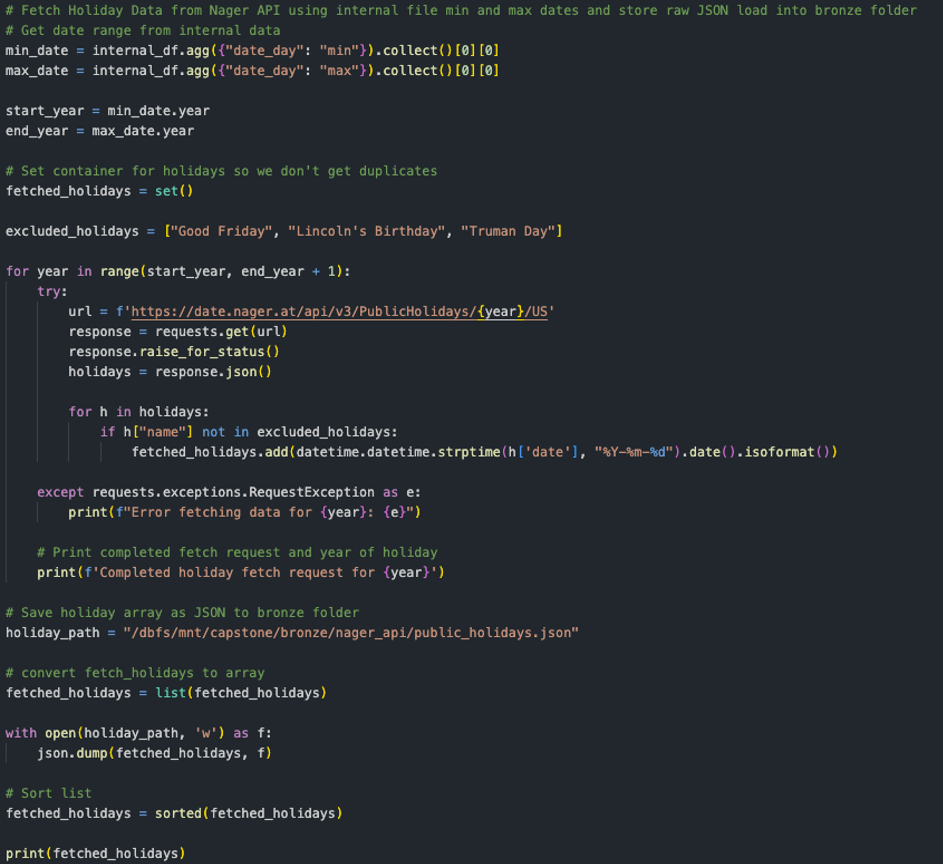
### Cleaning
 - Calculate null row count for Meta and Google datasets
 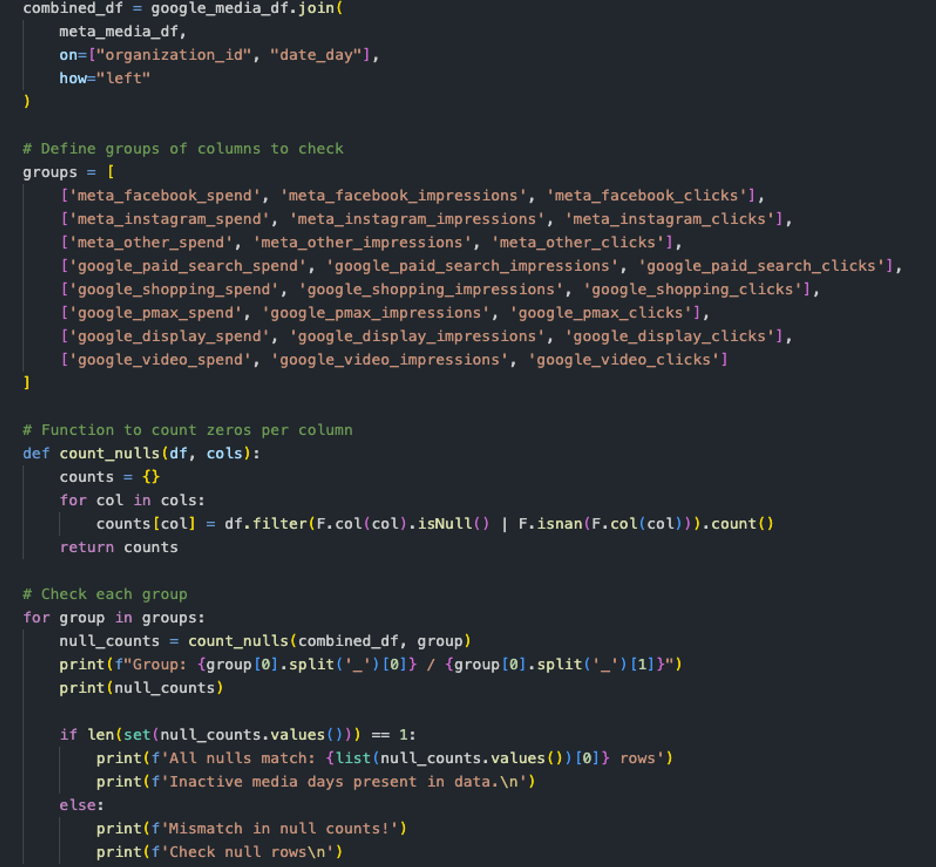
### Transforms
 - Make a Click-Through rate column by calculating existing clicks and impressions
 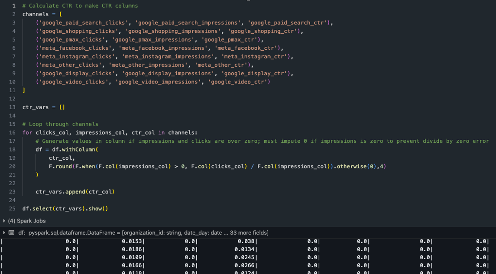
### Wrangling
 - Implement adstock to account for delayed advertising response and generate a new feature with average decay rates for the regression models
 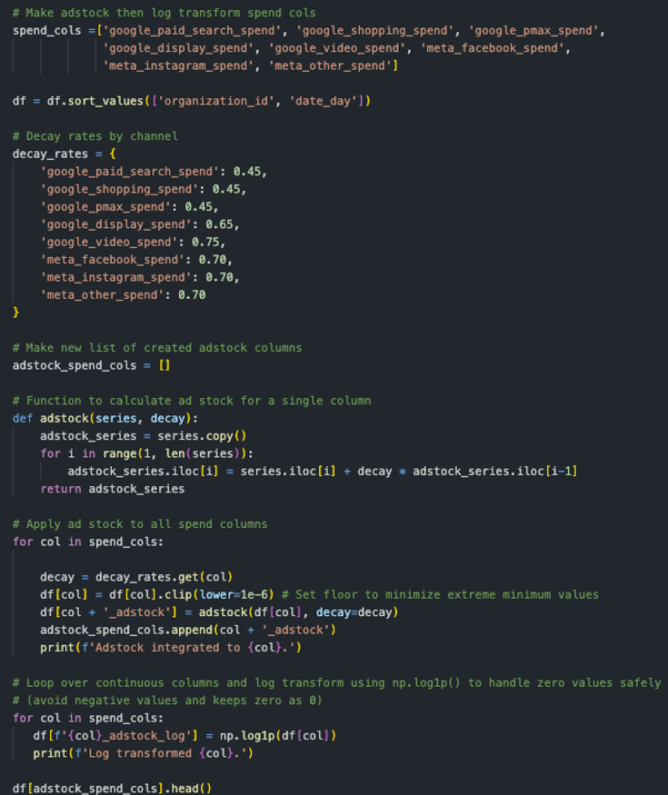

### Explorative Visualizations
 - Logarithmic transforms and visualization code of spend by channel
 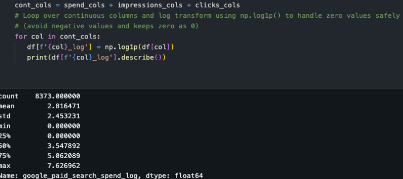
 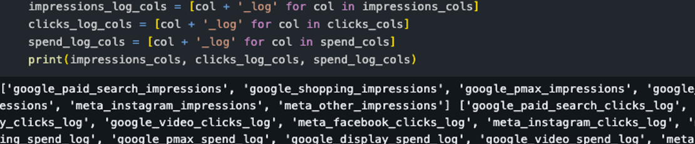
 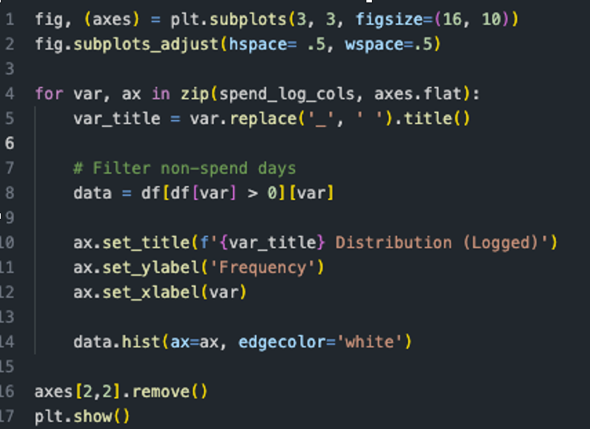

### Linear Regression Models
 - Splitting data into training and testing sets
 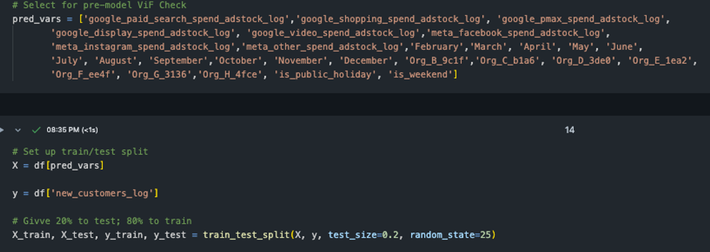
 - Variance Inflation Factor (VIF) checks for multicollinearity
 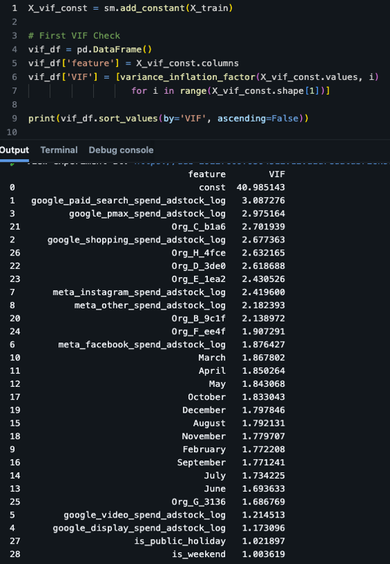
 - Reiterative backward stepwise elimination process to select statistically relevant features within a regression model
 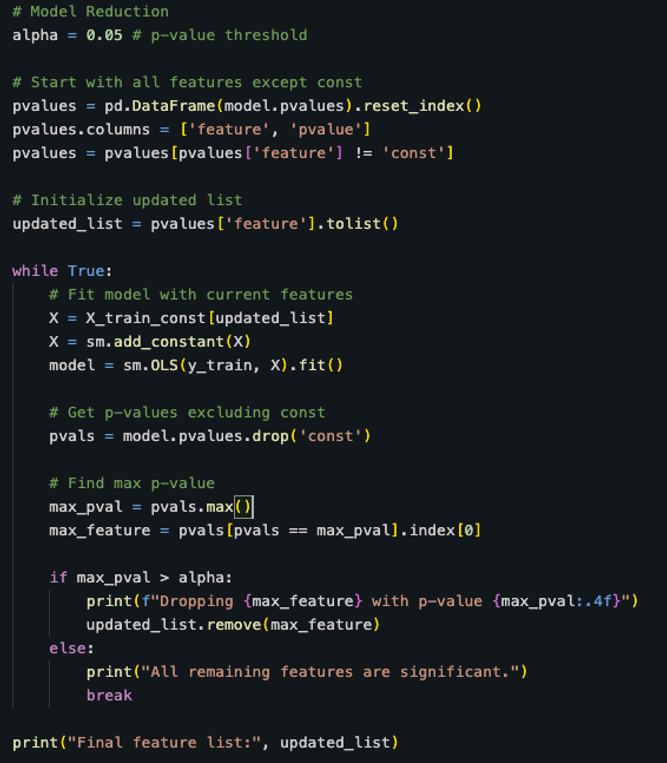

## Research Question and Hypothesis

Research Question: "How can digital media spend, performance metrics, and seasonality be processed through an ELT (extract, load, transform) solution into a model-ready dataset to evaluate the performance of a Multiple Linear Regression and Negative Binomial Regression model in predicting first purchase acquisitions to support optimizing budget allocation?"

Target Benchmarks:

- Multiple Linear Regression (MLR): Adjusted R-squared ≥ 0.60.
- Negative Binomial Regression (NBR): Pseudo-R-squared ≥ 0.10.
- Predictive Accuracy: 70% of predictions falling within ± 20% of actual values.

## Project Outcomes

The OLS Linear Regression Model provided a stronger statistically significant explanatory power and model fit compared to the Negative Binomial model. For business insights and presentation, this model can provide statistical backing to media budget recommendations.

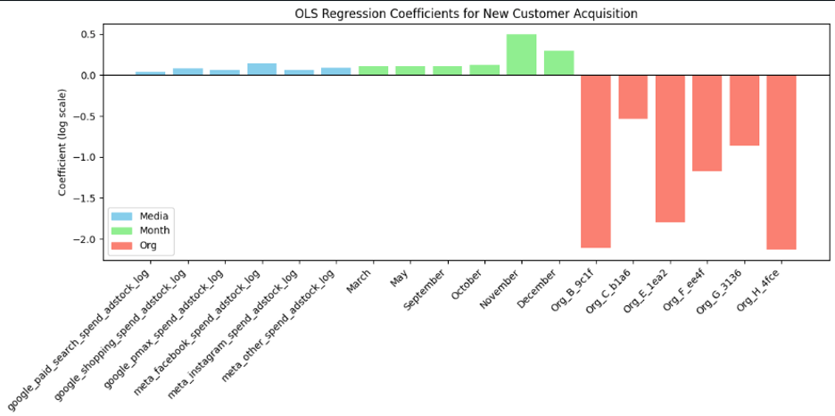

Some key actionable items include:

- Invest in high-impact media channels: Meta Facebook and Google Shopping are the two strongest channels that show the strongest positive influence. Prioritizing budget allocation to these channels could maximize first acquisition growth.
- Leverage seasonality: October, November, and December show the highest peaks for new customers. Planning promotions and sales based on first purchase incentives could drive additional acquisition potential.
- Plan around organizational strengths: Some organizations perform closer to the baseline (smaller negative coefficients). Focus high-effort campaigns or resource-intensive strategies in these stronger-performing organizations to maximize ROI while addressing weaker ones with lower-cost solutions.

## Tools Used

- Databricks
- Azure Data Lake Storage
- Python
- matplotlib, numpy, pyspark, seaborn, scikit-learn
