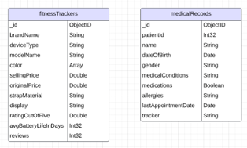
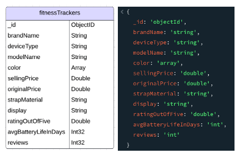
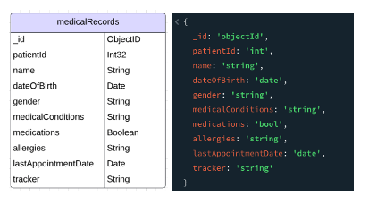

# README

## Project Summary

I designed and built a non-relational database given a number of JSON data with MongoDB in order to solve a business problem and provide analysis for a web application.

The process included:

- Exploration of Raw Data
- Developing Functional and Non-Functional Requirements
- Creating a Staging Database
- Implementation of Databases and Collections
- Performing Business-Related Queries
- Developing Aggregation Pipelines
- Optimizing Aggregation Pipelines with Indexes

The paper details the process in addition to justifying the noSQL database for the selected business problem, discussing security recommendations, and scalability considerations.

## Tools Used

- MongoDB
- mongoimport
- Mongo Shell
- Compass

## Pseudo Schema Development Screenshots

#### Pseudo Model

### Pseudo Model with Document - fitnessTrackers Database

#### Pseudo Model with Document - medicalRecords Database

