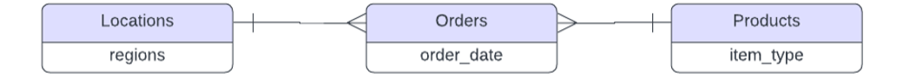
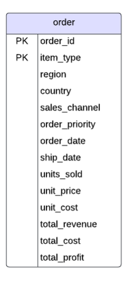
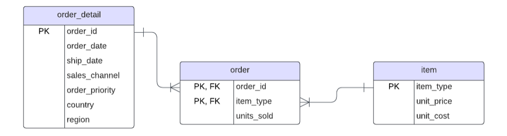
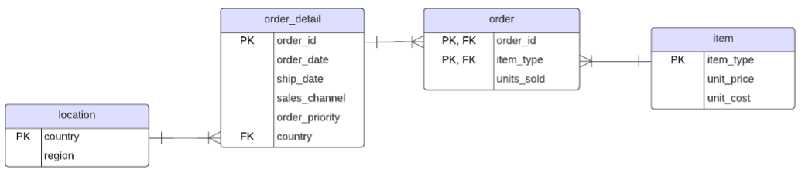
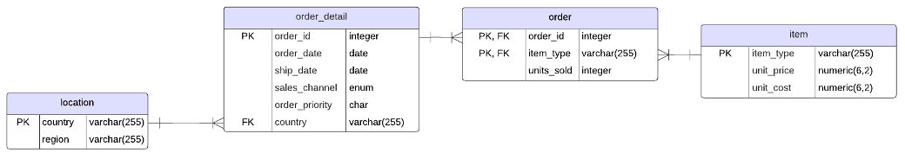
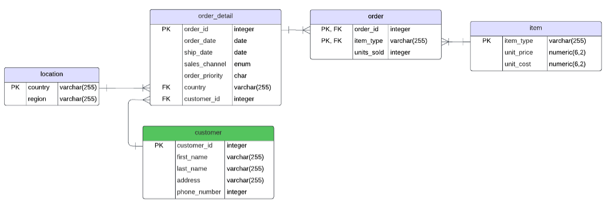

# README

## Project Summary

I designed and built a relational database given a number of raw datasets with PostGreSQL in order to solve a business problem and provide analysis.

The process included:

- Developing a Conceptual Data Model
- Exploration of Raw Data
- Designing a Normalized Schema
  - 1NF to 3NF
- Creating a Staging Database
- Implementing Normalized Schema
- Importing Transformed Data
- Performing Business-Related Queries
- Optimizing Queries with materialized Views

The paper details the process in addition to justifying the relational database for the selected business problem, discussing security recommendations, and scalability considerations.

## Tools Used

- PostgreSQL
- pgAdmin

## Schema Development Screenshots

#### Conceptual Model

#### 1NF

#### 2NF

#### 3NF

#### 3NF with Data Types

#### 3NF Additional Table

